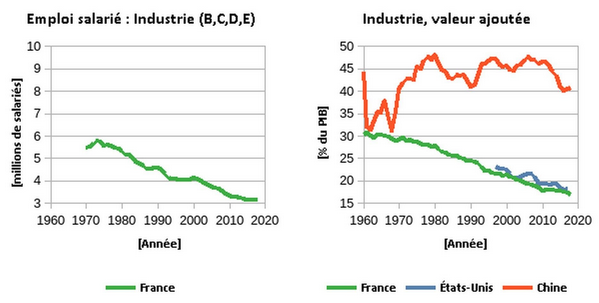
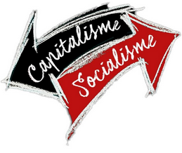

[//]: # (Title: Coronavirus : un révélateur des conséquences de l’abandon de l’hôpital et de l’industrie)  
[//]: # (Author: Manuel Joriatti, La Riposte)  
[//]: # (Date: 19 avril 2020)

Coronavirus : un révélateur des conséquences de l’abandon de l’hôpital et de l’industrie
===

Loin d’être un cas à part, le duo Macron-Philippe ne fait que prendre la suite d’une longue liste de dirigeants qui ont les uns après les autres diminué considérablement la couverture hospitalière du pays, tout en laissant le fleuron industriel sanitaire se délocaliser pour satisfaire la soif de profits des actionnaires. Derrière ces  équipes dirigeantes se cache un système capitaliste qui profite à une caste ultra minoritaire dans le pays et dont le pouvoir et la fortune tiennent à cet appareil d’état à sa solde et au capital qu’elle détient.

<!--more-->

*Par Manuel Joriatti, PCF Nord (59)*

La lente agonie de nos outils industriels
---

La pandémie due au coronavirus révèle les conséquences de la désindustrialisation : de nombreux sites industriels stratégiques majeurs en France sont fermés ou menacés de fermeture :
- Famar à Lyon, dont l’issue du redressement judiciaire reste incertaine : la production maintenue n’a aucune commune mesure avec la diversité de sa production passée,
- Honeywell à Plaintel, dont le démantèlement a stoppé net la production de masques en France,
- Luxfer à Gerzat dont la nationalisation a été rejetée par le parlement, laisse les salariés dans l’angoisse de la fermeture et l’Europe sans capacité de produire la moindre bouteille d’oxygène médical.

Il serait possible de continuer cette liste jusqu’à l’écœurement : la pénurie de nombreux biens est criante : médicaments, masques, gels hydroalcooliques, respirateurs…

*Figure 1: Évolution de l’emploi salarié (données : INSEE) et de la part des richesses crée dans l’industrie (données : Banque Mondiale)*

De nombreux syndicats CGT font le lien entre ces abandons et la stratégie menée par les capitalistes depuis de trop nombreuses années :
- pour peu que l’espérance de profit immédiat soit plus élevée, les capitalistes préfèrent fermer, délocaliser et détruire l’outil de travail pour qu’il ne puisse être repris par les salariés eux-mêmes,
- le savoir-faire des salariés et le besoin des populations n’a aucune valeur pour ces propriétaires des moyens de production.

Du fait de cette stratégie, [l’emploi salarié](https://www.insee.fr/fr/statistiques/serie/001577235#Telechargement) comme [la part des richesses créées dans l’industrie](https://donnees.banquemondiale.org/indicator/NV.IND.TOTL.KD?end=2018&locations=FR-CN-US&start=1960&view=chart) s’érodent continûment. Un des moyens régulièrement proposés pour maintenir une industrie apte à répondre aux besoins (quel que soit le domaine industriel, technique ou scientifique concerné) est de recourir aux nationalisations dès lors qu’une usine est menacée d’abandon pour ne pas avoir obtenu « une rentabilité à deux chiffres ».

La reprise par les salariés-eux même de leur activité est souhaitable, mais peut nécessiter une aide temporaire des pouvoirs publics pour contrer les tentatives de destruction des puissances capitalistes. Un bel exemple de cette forme de sauvegarde et de la difficulté de sa réalisation est le maintien de la production de thés 1336 par la Scop-TI (1336 jours de lutte pour préserver l’outil industriel qu’UNILEVER souhaitait détruire).

A toujours vouloir dégager un profit immédiat, la gestion capitaliste de l’économie court droit à sa prochaine crise. Réduisant comme peau de chagrin le peu d’industries restantes pour satisfaire nos besoins, même les plus élémentaires. Broyant les vies de familles entières lors de chaque délocalisation, lors de chaque fermeture, lors de chaque réforme budgétaire.

La casse de notre outil de « Sécurité Sociale »
---

Le même constat est valable pour notre système de santé et plus globalement à l’ensemble de la fonction publique : à trop avoir réduit les financements et les postes d’agents (considérés uniquement comme des centres de coûts, et en ignorant les bénéfices plus qualitatifs pour la population), l’État en a fini par ignorer jusqu’aux recommandations des groupes d’experts qu’il a pourtant lui-même mandatés ).  Par exemple en 2011, immédiatement après l’épidémie de SRAS, l’État décide de ne pas renouveler le stock stratégique de masques, [reniant ses engagements pris en 2005 envers les salariés de Honeywell](https://www.politis.fr/articles/2020/04/comment-letat-a-flingue-lusine-qui-fabriquait-ses-masques-41639/) et provoquant ainsi son démantèlement. L’apparition du MERS n’y changera rien : c’est la pénurie de masques qui est ainsi organisée pour économiser quelques deniers. Télécharger ici l’édifiant rapport de la DGAFP datant de 2012 où à partir de la page 111 ces évolutions d’effectifs sont flagrantes.

*Figure 2: Suppressions de postes de fonctionnaires – période de 2003 à 2011 (source : Les Echos)*

Dans la fonction publique hospitalière particulièrement, les réformes engagées depuis les années 80 ne visent qu’un seul objectif : économiser toujours plus.

- 1983 : Bérégovoy fixe les dépenses maximales des hôpitaux avec la dotation globale de financements,
- 1995 : Juppé crée l’Ondam, nouveau tour de vis pour l’assurance maladie, avec un budget voté au parlement chaque année puis imposé au service public de la santé,
- 2003 : Mattei présente le plan « Hôpital 2007 », rejoint par Douste-Blazy qui annonce la tarification à l’activité. Ils font ainsi du retour sur investissement la boussole de l’hôpital : exit les soins pour les patients non rentables,
- 2009 : Sarkozy et la loi HPST créé des directeurs d’hôpitaux avec mandat exclusif de gestions financière : 10 milliards d’économie sur 3 ans,
- 2016, Touraine veut « moderniser la santé » en regroupant des hôpitaux qui seront désormais plus loin des patients,
- 2018, malgré les promesses de campagnes, Macron cherche près d’1 milliard d’économies supplémentaires…

[La réduction du nombre de lits en soins intensifs](https://data.oecd.org/healtheqt/hospital-beds.htm) relève de cette logique comptable mortifère : il ne reste plus aujourd’hui que 5 000 lits de soins intensifs pour 68 millions d’habitants et un besoin estimé (à l’heure où ces lignes sont écrites) [à 15 000 lits au minimum](https://www.humanite.fr/hopital-les-lits-de-reanimation-nerf-de-la-guerre-sanitaire-687201). Osons une comparaison à l’Allemagne et ses 25 000 lits pour 83 millions d’habitants. Une Allemagne pourtant très critiquée à gauche, et critiquable à juste titre pour ses choix d’austérité.

*Figure 3: Évolution du nombre de lits depuis 1990 (données : OCDE)*

Les manifestations des personnels soignants et le « plan d’urgence pour l’hôpital » n’y changeront rien : la Fédération Hospitalière de France évalue à 8,6 milliards d’euros les économies demandées entre 2005 et 2019 et plus de la moitié des établissements sont en difficulté financière.

Les applaudissements que reçoivent les agents hospitaliers actuellement sont le signe du malaise créé par les gouvernements successifs pour avoir ignoré leurs revendications depuis de nombreuses années.

L’absence de réponses à leurs revendications est précisément la raison pour laquelle les agents hospitaliers sont qualifiés de « héros » : ils sont en nombre insuffisant, ils n’ont pas de stocks de gel hydroalcoolique, ni de masques en rapport à leurs besoins pour leur propre protection, leur matériel n’est pas toujours en bon état, le nombre de lits est insuffisant, les salaires ne sont plus attractifs du fait du gel des indices et diverses autres mesures d’économie poursuivies depuis de trop nombreuses années…

Face à ce constat, une exigence, déjà forte, se renforce : que les moyens de faire leur travail dans de bonnes conditions soient donnés aux agents du service public. Cela a un coût, nous devons nous organiser pour dégager les moyens de financement nécessaires pour nous assurer une vie avec la meilleure santé possible.

Pour répondre à la crise, et aux crises à venir, il nous faut donc extraire de l’économie marchande l’ensemble des activités essentielles regroupées dans la « Sécurité Sociale ». En attendant l’expropriation sans compensation des gros actionnaires, nous ne pouvons donc pas tolérer que les capitalistes continuent à s’exonérer de cotisations sociales et d’impôts, seuls moyens viables de financement des salaires des agents, de leurs outils de travail et de nos hôpitaux.

Pour une alternative à « L’État d’urgence sanitaire » comme moyen de coercition
---

« L’urgence sanitaire » souhaitée par l’État n’est qu’[un euphémisme pour sauvegarder les intérêts de la classe capitaliste](https://www.lariposte.org/2020/04/etat-durgence-sanitaire-ou-la-sauvegarde-du-capitalisme/) contre nos propres intérêts.

Les applaudissements pour nos soignants dépassent désormais largement les clivages qui avaient mené les « forces de l’ordre » à réprimer aveuglément sur ordre de leurs hiérarchies : gilets jaunes comme agents de la fonction hospitalière en sortent mutilés pour certains. Policier et gendarmes s’aperçoivent probablement aujourd’hui qu’eux aussi disposent de peu de moyens pour protéger la population et se protéger eux-mêmes.

Face à un virus, les provocations de quelques centurions récalcitrants et autres LBD ne servent à rien : l’utilité de ces méthodes et armes de guerre n’est que de défendre les intérêts capitalistes pour permettre à quelques grandes fortunes de continuer à s’enrichir injustement par le maintien de trop coûteuses exonérations sociales et fiscales. Exonération qui conduisent au sous-financement, au sous-équipement et au sous-emploi dans nos services publics : depuis l’hôpital jusqu’aux « forces de l’ordre » en passant par les retraites de nos aînés et l’éducation de nos cadets.

Face à ce même virus, les « riens » d’hier sont devenus en paroles les « héros » d’aujourd’hui. Mais, chez les capitalistes et leurs serviteurs, les actes ne rejoignent pas les paroles : la priorité du gouvernement a bien été de promulguer des ordonnances rétrogrades pour exploiter toujours plus les salariés tout en laissant péricliter les moyens de production qui nous font pourtant cruellement défaut : masques, ventilateurs, médicaments…

Plutôt que de nationaliser les entreprises de ces secteurs vitaux, plutôt que de rétablir l’ISF ou de ponctionner les dividendes records qu’ont pu se verser une minorité d’exploiteurs (les avances sur dividende 2020 déjà versées ne peuvent de surcroît pas être reprises avec la législation actuelle), la priorité du Gouvernement a été d’appeler à la générosité de ceux « qui sont tout » et qu’ils espèrent croiser dans les gares tout en amenuisant le droit des travailleurs.

Pour sortir de cette crise dignement, il faudra plus que ces quelques espoirs de dons : la réappropriation par les salariés des pans essentiels de l’économie est l’unique moyen de réorienter la production vers la réponse à nos besoins. Il nous faut également redonner à notre police et notre armée leur mission première de servir les citoyens et leur donner les moyens nécessaires à cette mission. Avec des moyens, peut-être auraient-ils pu déployer des hôpitaux de campagne sans délais… et par la même contribuer à sauver des vies ?

Enfin, ce sont les salariés eux-mêmes qui doivent – et savent – décider des conditions dans lesquelles ils assurent la production nécessaire et ce qui constitue une « activité vitale et essentielle » pour répondre à la crise actuelle. Et pour cela, il n’est pas besoin d’ordonnance rétrogrades, ni de police coercitive. Malgré le manque de moyens, des millions de citoyens nous montrent chaque jour leur exemplarité : soignants, agents d’entretien, caissières, éboueurs, ouvriers, cadres, techniciens, professeurs…

D’ailleurs, des centres « Covid » ont été ouverts spontanément aux quatre coins du pays [par des personnels médicaux bénévoles](https://www.francebleu.fr/infos/sante-sciences/les-potentiels-malades-du-covid-19-accueillis-dans-des-centres-d-urgence-1585260552), et la solidarité dans les quartiers s’est mise en marche rapidement, comme dans ce Mac Do marseillais [réquisitionné par ses salariés](https://www.revolutionpermanente.fr/Un-McDo-marseillais-requisitionne-par-les-travailleurs-pour-donner-de-la-nourriture-dans-les) pour distribuer de l’aide alimentaire aux familles en détresse.

Nous sommes tous présents pour ces activités essentielles : nous soigner lorsque nous sommes malades, nous apporter l’électricité nécessaire à nos logements, nos hôpitaux et nos industries, ramasser nos déchets pour que nos lieux de vie ne se transforment pas en décharges à ciel ouvert, et nous nourrir lorsque l’urgence devient vitale…

Sans ces mesures radicales, l’après crise sanitaire pourrait prendre un virage toujours plus rétrograde, comme ce fut le cas après la « bulle internet » de 2000 ou après la crise « des subprimes » de 2008 : un virage qui ne ferait que renforcer les exonérations pour les capitalistes et réduire toujours plus les droits et les moyens pour les « riens » que nous sommes à leurs yeux.

Le capitalisme ne désarme jamais, il nous appartient de contre-attaquer jusqu’à l’expropriation des fraudeurs sociaux et fiscaux, jusqu’à la réquisition de nos moyens de production. Les exonérations de plus en plus importantes dont bénéficient les capitalistes sont semblables à un vol des produits de notre force de travail. Un accaparement des richesses que nous avons produites et que les capitalistes réquisitionnent à leur seul profit. En expropriant les capitalistes, nous nous réapproprierons les moyens de production nécessaires pour financer nos services publics.

